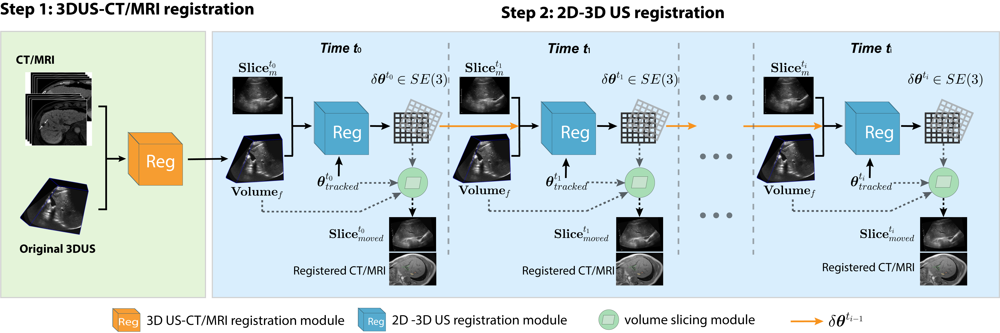

# DeepRegS2V
2D US-CT/MRI registration can aid in interpreting anatomical details and identifying tumours, but their clinical application has been hindered by the tradeoff between alignment accuracy and runtime performance, particularly when compensating for liver motion due to patient breathing or movement. Therefore, we proposed a 2D US-CT/MRI registration workflow. In our previous [work](https://link.springer.com/article/10.1007/s11548-023-02915-0), we developed the first registration step, “3D US-to-CT/MRI”, to facilitate the procedure. This work focuses on the second registration step, “dynamic 2D-to-3D US”, to demonstrate the clinical effectiveness of mitigating the effect of liver motion, thereby improving tumor visibility during procedures.

## Introduction
TODO

## Environment
TODO

## Training
TODO

## Testing
TODO

## Trouble Shooting
TODO

## Citation
TODO
